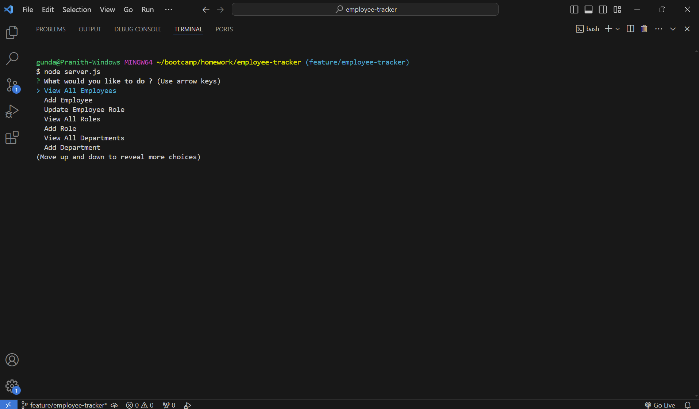
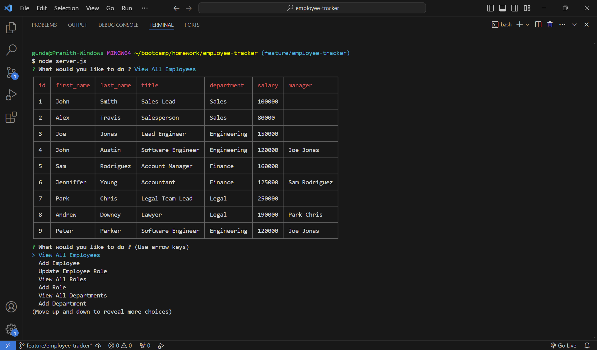
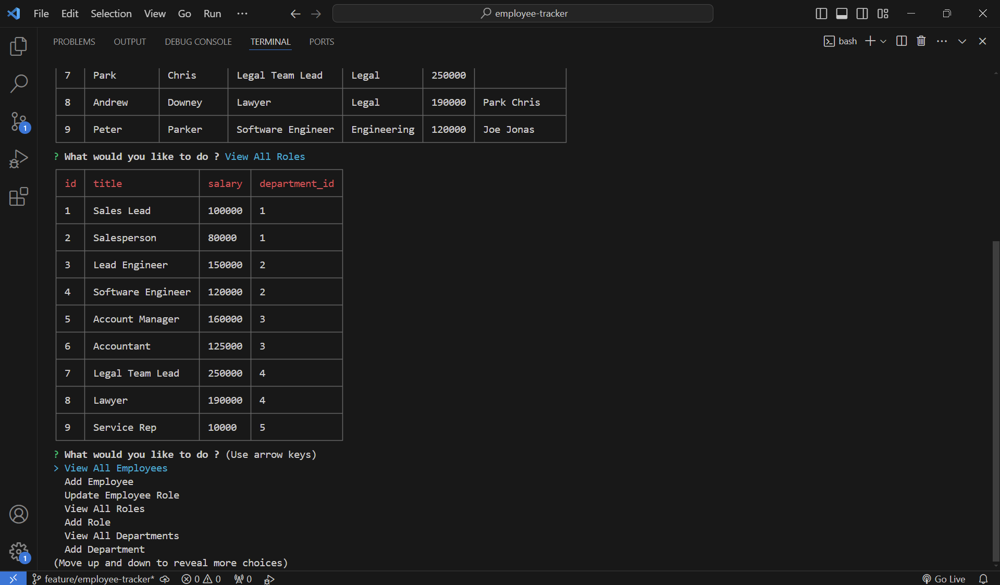
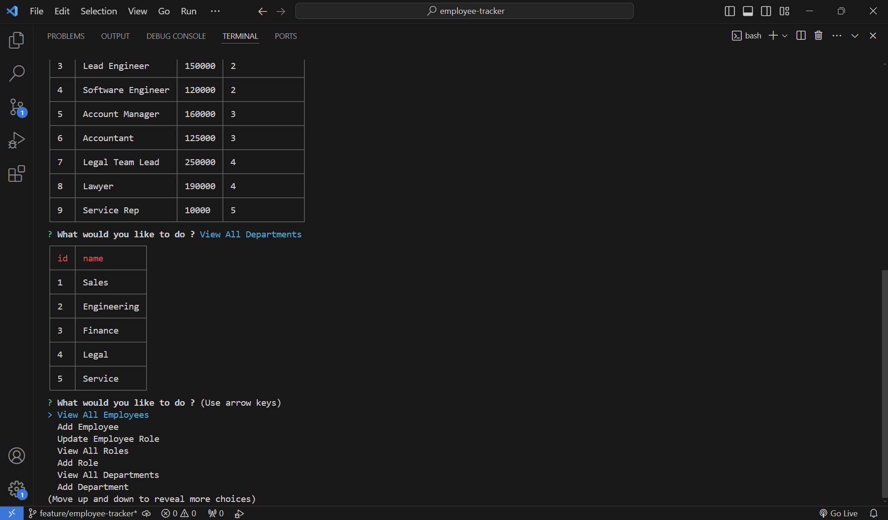
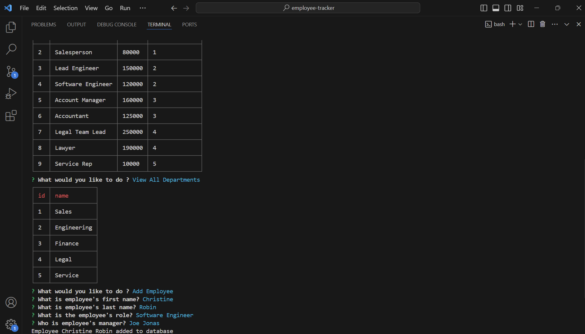

# EMPLOYEE-TRACKER

## Description

Employee Tracker is a command line application built to manage employee data. Using this application you can view all employees, their roles and department they belong to.

This command line application is built using node.js and leverages inquirer, pg and cli packages from npm. Employee data is maintained in POSTGRESQL database and actions performed through cli are updated in database realtime.

## Screenshots

## Link To Video Demonstration

https://drive.google.com/file/d/1QgMGhTsKA66QHQbnIU0pi_6xEJW_N5t8/view